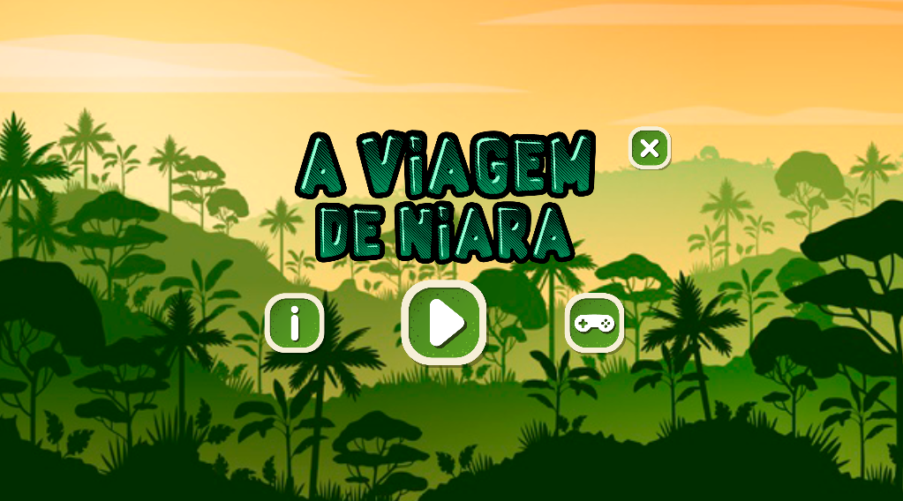
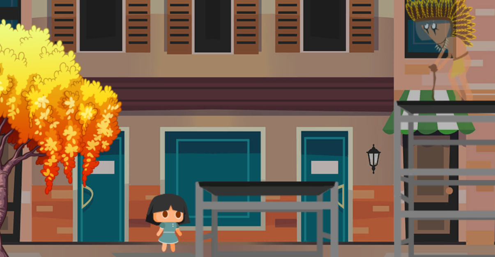
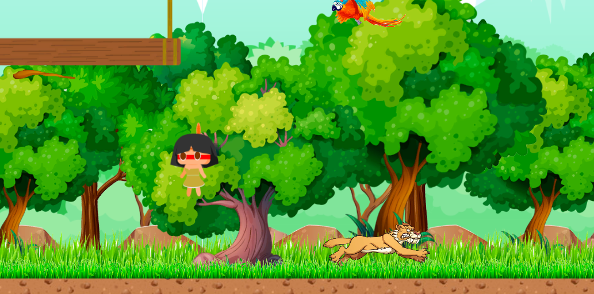
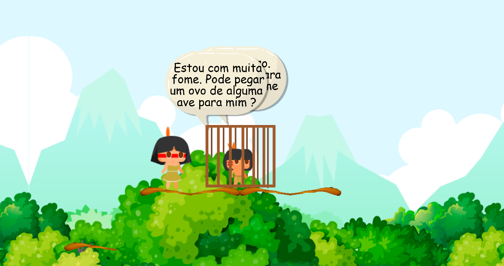
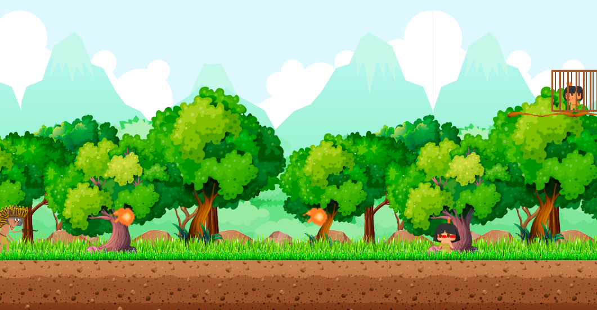

# Jogo - Viagem de Niara
Por: [***Francisco Henrique***](https://www.linkedin.com/in/francisco-henrique-010912189)

### -Projeto desenvolvido utilizando á *Game Engine* [Unity](https://unity.com/) com C#.

## Objetivo
- Apresentar e Orientar como funciona o Game Viagem de Niara, Projeto 2D.

## Gameplay
- O jogo possui quatro fases.

### **Fase 1:** 
Caminhe pela cidade e siga as aparições de um ser indígena pelo seu caminho, você deve encontrar
um colar mágico, e falar com o ser misterioso no final da fase.

### **Fase 2:** 
Passe pelos obstáculos da floresta e puxe o cipó que está mantendo o índio preso, também ache algo para o 
índio comer.

### **Fase 3:** 
Passe pelos obstáculos da floresta e puxe os 3 cipós que estão mantendo os índios presos, 
também ache algo para os índios comerem.

### **Fase 4:** 
Derrote o chefe para vencer o Jogo.

### Controles

* **Tecla Espaço:** Pulo.

* **A:** Esquerda.

* **D:** Direita.

* **S:** Direita.

## Para Executar:

* WEB: Na pasta Executável-WEB Rode o arquivo index.html e ele abrirá no seu navegador.

* PC: Na pasta Executável-PC rode o arquivo ViagemDeNiara.exe e ele abrirá em sua máquina.

## Créditos
- [***Francisco Henrique***](https://www.linkedin.com/in/francisco-henrique-010912189)
- [***Jean Nunes***](https://github.com/NaejNunes)
- [***Leonardo Prado***](https://github.com/Leonardoaprado)
- [***Mauricio Gatto***](https://www.facebook.com/mauricio.gatto)

